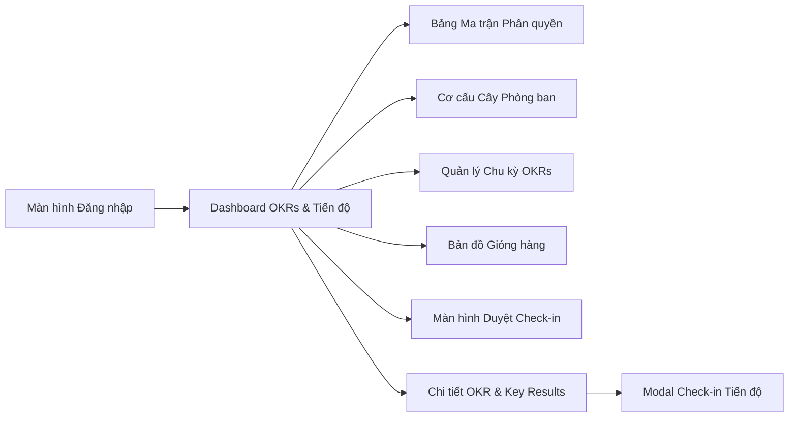

# OKR Enterprise Backend API - Tài Liệu & Hướng Dẫn Tích Hợp Frontend

Tài liệu kỹ thuật toàn diện dành cho **Frontend Developer** để tích hợp và hoàn thiện giao diện ứng dụng Quản trị Mục tiêu & Kết quả Then chốt (**OKRs Enterprise**).

Hệ thống xây dựng trên **NestJS 10**, **Prisma ORM (v7)**, **MySQL / MariaDB**, kiến trúc phân quyền động **Dynamic RBAC (5-Table Architecture)** và tài liệu tương tác **Swagger UI**.

---

## 📑 Mục lục

1. [Thông tin môi trường & Khởi động](#1-thông-tin-môi-trường--khởi-động)
2. [Hướng dẫn tích hợp cơ bản cho Frontend](#2-hướng-dẫn-tích-hợp-cơ-bản-cho-frontend)
   - [2.1 Cấu hình HTTP Client (Axios / Fetch)](#21-cấu-hình-http-client-axios--fetch)
   - [2.2 Cơ chế Xác thực & Refresh Token Rotation](#22-cơ-chế-xác-thực--refresh-token-rotation)
   - [2.3 Phân quyền giao diện động (Role-Based UI Rendering)](#23-phân-quyền-giao-diện-động-role-based-ui-rendering)
   - [2.4 Quy chuẩn Dữ liệu BigInt & ID](#24-quy-chuẩn-dữ-liệu-bigint--id)
3. [Bảng Tra Cứu Enums & Kiểu Dữ Liệu Toàn Hệ Thống](#3-bảng-tra-cứu-enums--kiểu-dữ-liệu-toàn-hệ-thống)
4. [Chi Tiết API Theo Từng Màn Hình Giao Diện (Screen-by-Screen API Reference)](#4-chi-tiết-api-theo-từng-màn-hình-giao-diện)
   - [Màn hình 1: Đăng nhập & Quản lý Phiên (Auth)](#màn-hình-1-đăng-nhập--quản-lý-phiên-auth)
   - [Màn hình 2: Bảng Ma Trận Phân Quyền Động (Dynamic Permission Matrix)](#màn-hình-2-bảng-ma-trận-phân-quyền-động-dynamic-permission-matrix)
   - [Màn hình 3: Quản lý Tài khoản & Gán Vai trò (Users & Roles Assignment)](#màn-hình-3-quản-lý-tài-khoản--gán-vai-trò-users--roles-assignment)
   - [Màn hình 4: Sơ đồ Cây Cơ cấu Tổ chức (Organization Tree / Departments)](#màn-hình-4-sơ-đồ-cây-cơ-cấu-tổ-chức-organization-tree--departments)
   - [Màn hình 5: Quản lý Chu kỳ OKRs (Cycles Management)](#màn-hình-5-quản-lý-chu-kỳ-okrs-cycles-management)
   - [Màn hình 6: Bảng Dashboard Mục tiêu OKRs & Phê duyệt (Objectives Dashboard)](#màn-hình-6-bảng-dashboard-mục-tiêu-okrs--phê-duyệt-objectives-dashboard)
   - [Màn hình 7: Bản đồ Gióng hàng Chiến lược (Vertical & Cross Alignments)](#màn-hình-7-bản-đồ-gióng-hàng-chiến-lược-vertical--cross-alignments)
   - [Màn hình 8: Kết quả Then chốt & Công thức Tiến độ có Trọng số (Key Results)](#màn-hình-8-kết-quả-then-chốt--công-thức-tiến-độ-có-trọng-số-key-results)
   - [Màn hình 9: Thực hiện Check-in & Lịch sử Biến động (Audit Log Timeline)](#màn-hình-9-thực-hiện-check-in--lịch-sử-biến-động-audit-log-timeline)
   - [Màn hình 10: Màn hình Quản lý Phê duyệt Check-in (Pending Reviews)](#màn-hình-10-màn-hình-quản-lý-phê-duyệt-check-in-pending-reviews)
5. [Danh sách 12 Tài Khoản Dữ Liệu Mẫu Quý 3 (Demo Test Accounts)](#5-danh-sách-12-tài-khoản-dữ-liệu-mẫu-quý-3-demo-test-accounts)

---

## 1. Thông tin môi trường & Khởi động

- **Backend Base URL**: `http://localhost:3000`
- **Tài liệu Swagger UI Tương tác**: 👉 **`http://localhost:3000/swagger`**
- **Lệnh chạy Backend (Dev Watch)**:
  ```bash
  npm run start:dev
  ```
- **Lệnh tạo toàn bộ dữ liệu mẫu Quý 3 (10 OKRs, 12 Gióng hàng, 12 Users, Timeline Check-ins)**:
  ```bash
  npm run seed:demo
  ```

---

## 2. Hướng dẫn tích hợp cơ bản cho Frontend

### 2.1 Cấu hình HTTP Client (Axios / Fetch)

Khi gửi request lên Backend, Frontend cần chú ý 2 cấu hình bắt buộc:
1. **`withCredentials: true`**: Cho phép trình duyệt gửi và nhận Cookie `HttpOnly` (`refreshToken`).
2. **`Authorization: Bearer <accessToken>`**: Gắn token truy cập vào header của các request yêu cầu xác thực.

```typescript
// src/api/axiosClient.ts
import axios from 'axios';

export const apiClient = axios.create({
  baseURL: 'http://localhost:3000',
  withCredentials: true, // BẮT BUỘC để nhận/gửi HttpOnly cookie
  headers: {
    'Content-Type': 'application/json',
  },
});

// Gắn accessToken vào Header
apiClient.interceptors.request.use((config) => {
  const token = localStorage.getItem('accessToken');
  if (token && config.headers) {
    config.headers.Authorization = `Bearer ${token}`;
  }
  return config;
});

// Tự động Refresh Token khi gặp lỗi 401
apiClient.interceptors.response.use(
  (response) => response,
  async (error) => {
    const originalRequest = error.config;
    if (error.response?.status === 401 && !originalRequest._retry && originalRequest.url !== '/auth/login') {
      originalRequest._retry = true;
      try {
        const res = await axios.post(
          'http://localhost:3000/auth/refresh',
          {},
          { withCredentials: true }
        );
        const newAccessToken = res.data.accessToken;
        localStorage.setItem('accessToken', newAccessToken);
        originalRequest.headers.Authorization = `Bearer ${newAccessToken}`;
        return apiClient(originalRequest);
      } catch (refreshErr) {
        localStorage.removeItem('accessToken');
        window.location.href = '/login';
        return Promise.reject(refreshErr);
      }
    }
    return Promise.reject(error);
  }
);
```

---

### 2.2 Cơ chế Xác thực & Refresh Token Rotation

1. **Đăng nhập (`POST /auth/login`)**:
   - Response trả về: `{ accessToken, user }`.
   - Lưu `accessToken` vào `localStorage` (hoặc memory).
   - Cookie `refreshToken` (HttpOnly, SameSite) được Backend tự động set trên trình duyệt.
2. **Lấy thông tin tài khoản hiện tại (`GET /auth/profile`)**:
   - Trả về thông tin cá nhân kèm toàn bộ mảng `roles` (các vai trò) và mảng `permissions` (danh sách quyền chi tiết dạng `["objective:create", "checkin:review", ...]`).
3. **Đăng xuất (`POST /auth/logout`)**:
   - Backend xóa bản ghi refresh token trong DB và xóa cookie trên browser. Frontend chỉ cần xóa `accessToken` ở localStorage.

---

### 2.3 Phân quyền giao diện động (Role-Based UI Rendering)

Sau khi đăng nhập, lưu mảng `permissions` từ `GET /auth/profile` vào Global State (Pinia / Redux / Zustand). Sử dụng helper function để ẩn/hiện nút bấm, menu hoặc khóa các chức năng trên UI:

```typescript
// src/utils/permissions.ts
export function hasPermission(userPermissions: string[], requiredPermission: string): boolean {
  // SUPER_ADMIN hoặc người có quyền tương ứng
  return userPermissions.includes(requiredPermission);
}

// Ví dụ sử dụng trong React / Vue:
// {hasPermission(user.permissions, 'objective:approve') && <ApproveButton />}
// {hasPermission(user.permissions, 'role:update') && <EditMatrixButton />}
```

---

### 2.4 Quy chuẩn Dữ liệu BigInt & ID

Toàn bộ ID trong Database sử dụng kiểu `BigInt` (64-bit) nhưng đã được Backend tự động chuyển đổi thành **`String`** (`"1"`, `"2"`, `"105"`) khi gửi sang JSON.
- **Frontend nhận ID**: Dạng `string` (ví dụ: `objective.id = "3"`).
- **Frontend gửi ID lên Params/Body**: Có thể truyền dưới dạng `string` hoặc `number` (Backend tự động parse sang `BigInt`).

---

## 3. Bảng Tra Cứu Enums & Kiểu Dữ Liệu Toàn Hệ Thống

| Tên Enum / Field | Các Giá Trị Hợp Lệ | Mô Tả & Ý Nghĩa |
| :--- | :--- | :--- |
| **`RoleCode`** | `SUPER_ADMIN`, `OKR_CHAMPION`, `MANAGER`, `EMPLOYEE`, `VIEWER` | Mã vai trò người dùng trong hệ thống. |
| **`ObjectiveLevel`** | `COMPANY`, `DEPARTMENT`, `INDIVIDUAL` | Cấp độ Mục tiêu: Công ty / Phòng ban / Cá nhân. |
| **`Status`** | `DRAFT`, `PENDING`, `APPROVED`, `REJECTED`, `ACTIVE`, `CLOSED` | Trạng thái chung (OKR, Check-in, Chu kỳ, Phòng ban). |
| **`UnitType`** | `PERCENTAGE`, `CURRENCY`, `NUMERIC`, `BOOLEAN` | Đơn vị tính của Kết quả then chốt (Key Result). |
| **`ConfidenceScore`**| `HIGH`, `MEDIUM`, `LOW` | Điểm tự tin hoàn thành mục tiêu (Xanh / Vàng / Đỏ). |
| **`AlignmentType`** | `VERTICAL`, `CROSS` | Gióng hàng Dọc (cấp trên) hoặc Chéo (liên phòng ban). |
| **`CycleType`** | `QUARTERLY`, `ANNUAL` | Loại chu kỳ: Quý (3 tháng) hoặc Năm (12 tháng). |

---

## 4. Chi Tiết API Theo Từng Màn Hình Giao Diện



---

### Màn hình 1: Đăng nhập & Quản lý Phiên (Auth)

#### 1. Đăng nhập
- **Endpoint**: `POST /auth/login`
- **Body**:
  ```json
  {
    "email": "ceo@example.com",
    "password": "Password@123"
  }
  ```
- **Response `200 OK`**:
  ```json
  {
    "accessToken": "eyJhbGciOiJIUzI1NiIsInR5cCI6IkpXVCJ9...",
    "user": {
      "id": "1",
      "email": "ceo@example.com",
      "fullName": "Trần Văn Long",
      "jobTitle": "Chief Executive Officer (CEO)",
      "avatarUrl": "https://images.unsplash.com/photo-1534528741775-53994a69daeb?w=150",
      "departmentId": "1",
      "roles": ["SUPER_ADMIN"],
      "permissions": ["user:create", "objective:approve", "..."]
    }
  }
  ```

#### 2. Lấy thông tin tài khoản hiện tại (Profile & Permissions)
- **Endpoint**: `GET /auth/profile`
- **Headers**: `Authorization: Bearer <accessToken>`
- **Response `200 OK`**: Trả về thông tin đầy đủ kèm danh sách vai trò và 34 quyền hạn chi tiết.

#### 3. Làm mới Access Token
- **Endpoint**: `POST /auth/refresh`
- **Response `200 OK`**: `{ "accessToken": "new_access_token_string" }`

#### 4. Đăng xuất
- **Endpoint**: `POST /auth/logout`
- **Response `200 OK`**: `{ "message": "Logged out successfully" }`

---

### Màn hình 2: Bảng Ma Trận Phân Quyền Động (Dynamic Permission Matrix)

Màn hình cho phép Quản trị viên xem ma trận dạng bảng lưới (Roles làm cột, Modules & Permissions làm dòng) và tick/bỏ tick để phân quyền theo thời gian thực.

#### 1. Lấy dữ liệu toàn bộ Ma trận phân quyền (1 Request duy nhất để vẽ Bảng)
- **Endpoint**: `GET /permissions/matrix`
- **Response `200 OK`**:
  ```json
  {
    "roles": [
      { "id": "1", "code": "SUPER_ADMIN", "name": "Quản trị viên cấp cao", "isSystem": true },
      { "id": "2", "code": "OKR_CHAMPION", "name": "OKR Champion", "isSystem": false },
      { "id": "3", "code": "MANAGER", "name": "Quản lý", "isSystem": false },
      { "id": "4", "code": "EMPLOYEE", "name": "Nhân viên", "isSystem": false },
      { "id": "5", "code": "VIEWER", "name": "Người xem", "isSystem": false }
    ],
    "modules": [
      {
        "module": "objectives",
        "moduleName": "Quản lý Mục tiêu (Objectives)",
        "permissions": [
          { "id": "17", "code": "objective:create", "action": "create", "subject": "Objective", "description": "Tạo mới Mục tiêu" },
          { "id": "18", "code": "objective:read", "action": "read", "subject": "Objective", "description": "Xem chi tiết Mục tiêu" },
          { "id": "19", "code": "objective:update", "action": "update", "subject": "Objective", "description": "Chỉnh sửa Mục tiêu" },
          { "id": "20", "code": "objective:delete", "action": "delete", "subject": "Objective", "description": "Xóa Mục tiêu" },
          { "id": "21", "code": "objective:approve", "action": "approve", "subject": "Objective", "description": "Phê duyệt OKR" }
        ]
      },
      {
        "module": "checkins",
        "moduleName": "Quản lý Check-in & Tiến độ",
        "permissions": [
          { "id": "29", "code": "checkin:create", "action": "create", "subject": "CheckIn", "description": "Tạo bản Check-in" },
          { "id": "33", "code": "checkin:review", "action": "approve", "subject": "CheckIn", "description": "Duyệt Check-in" }
        ]
      }
    ],
    "matrix": {
      "1": {
        "roleId": "1",
        "roleCode": "SUPER_ADMIN",
        "permissionCodes": ["user:create", "objective:create", "objective:approve", "checkin:review", "..."]
      },
      "3": {
        "roleId": "3",
        "roleCode": "MANAGER",
        "permissionCodes": ["objective:read", "objective:approve", "checkin:review"]
      }
    }
  }
  ```
- **💡 Cách render trên FE**:
  - Render cột: Lặp qua mảng `roles`.
  - Render dòng: Lặp qua từng nhóm `modules` $\rightarrow$ lặp qua từng `permission`.
  - Checkbox state: `matrix[roleId].permissionCodes.includes(permission.code)`.

#### 2. Lưu cập nhật Phân quyền cho một Vai trò từ Bảng Ma trận
- **Endpoint**: `PUT /roles/:id/permissions`
- **Body**:
  ```json
  {
    "permissionCodes": [
      "objective:read",
      "objective:create",
      "objective:update",
      "objective:approve",
      "checkin:create",
      "checkin:review"
    ]
  }
  ```
- **Response `200 OK`**: `{ "message": "Permissions updated successfully", "totalPermissions": 6 }`

#### 3. Quản lý Danh sách Vai trò (Roles CRUD)
- `GET /roles`: Lấy danh sách tất cả các vai trò.
- `POST /roles`: Tạo vai trò tùy chỉnh mới (`{ "name": "Team Lead", "code": "TEAM_LEAD", "description": "Trưởng nhóm" }`).
- `PUT /roles/:id`: Cập nhật thông tin vai trò.
- `DELETE /roles/:id`: Xóa vai trò (Hệ thống tự động chặn không cho xóa vai trò `isSystem: true`).

---

### Màn hình 3: Quản lý Tài khoản & Gán Vai trò (Users & Roles Assignment)

#### 1. Lấy danh sách nhân sự
- **Endpoint**: `GET /users`
- **Response `200 OK`**: Danh sách users kèm phòng ban (`department`), quản lý trực tiếp (`manager`) và danh sách vai trò (`roles`).

#### 2. Tạo tài khoản nhân sự mới
- **Endpoint**: `POST /users`
- **Body**:
  ```json
  {
    "email": "dev.new@example.com",
    "password": "Password@123",
    "fullName": "Trần Quốc Hưng",
    "jobTitle": "Backend Developer",
    "avatarUrl": "https://example.com/avatar.jpg",
    "departmentId": "3",
    "managerId": "3",
    "roleCodes": ["EMPLOYEE"]
  }
  ```

#### 3. Cập nhật thông tin cá nhân
- **Endpoint**: `PUT /users/:id`
- **Body**: `{ "fullName": "...", "jobTitle": "...", "avatarUrl": "...", "departmentId": "3" }`

#### 4. Gán vai trò cho người dùng (Dynamic Role Assignment Modal)
- **Endpoint**: `PUT /users/:id/roles`
- **Body**:
  ```json
  {
    "roleCodes": ["MANAGER", "OKR_CHAMPION"]
  }
  ```

---

### Màn hình 4: Sơ đồ Cây Cơ cấu Tổ chức (Organization Tree / Departments)

#### 1. Lấy cấu trúc cây phân cấp phòng ban (Organization Tree)
- **Endpoint**: `GET /departments/tree`
- **Response `200 OK`**:
  ```json
  [
    {
      "id": "1",
      "name": "Ban Giám đốc",
      "description": "Cơ quan điều hành cấp cao",
      "parentId": null,
      "manager": {
        "id": "1",
        "fullName": "Trần Văn Long",
        "email": "ceo@example.com",
        "jobTitle": "Chief Executive Officer (CEO)"
      },
      "memberCount": 2,
      "children": [
        {
          "id": "2",
          "name": "Khối Công nghệ & Sản phẩm",
          "parentId": "1",
          "manager": { "id": "2", "fullName": "Nguyễn Minh Tuấn", "jobTitle": "CTO" },
          "memberCount": 1,
          "children": [
            {
              "id": "3",
              "name": "Phòng Kỹ thuật Phần mềm",
              "parentId": "2",
              "manager": { "id": "3", "fullName": "Lê Hoàng Nam", "jobTitle": "Lead Dev" },
              "memberCount": 3,
              "children": []
            }
          ]
        }
      ]
    }
  ]
  ```

#### 2. Thao tác Phòng ban (CRUD)
- `POST /departments`: Tạo phòng ban mới (`{ "name": "Phòng Mobile App", "parentId": "2", "managerId": "3" }`).
- `PUT /departments/:id`: Sửa phòng ban (chuyển phòng ban cha hoặc đổi Manager).
- `DELETE /departments/:id`: Xóa mềm phòng ban (Chặn nếu đang có phòng ban con).

---

### Màn hình 5: Quản lý Chu kỳ OKRs (Cycles Management)

#### 1. Lấy danh sách chu kỳ
- **Endpoint**: `GET /cycles`
- **Response `200 OK`**: Danh sách chu kỳ sắp xếp theo ngày mới nhất.

#### 2. Lấy chu kỳ hiện tại (Active Cycle)
- **Endpoint**: `GET /cycles/current`
- **Response `200 OK`**: Trả về chu kỳ đang `ACTIVE` khớp với ngày hiện tại (dùng để gán mặc định vào Filter trên Topbar).

#### 3. Tạo chu kỳ mới
- **Endpoint**: `POST /cycles`
- **Body**:
  ```json
  {
    "title": "Chu kỳ Quý 4 - 2026",
    "code": "2026-Q4",
    "type": "QUARTERLY",
    "startDate": "2026-10-01T00:00:00.000Z",
    "endDate": "2026-12-31T23:59:59.000Z"
  }
  ```

#### 4. Khóa chu kỳ OKRs (`CLOSED` - Đóng băng dữ liệu)
- **Endpoint**: `PATCH /cycles/:id/status`
- **Body**: `{ "status": "CLOSED" }`
- **💡 Lưu ý cho FE**: Khi `cycle.status === 'CLOSED'`, FE nên disable các nút: Thêm/Sửa/Xóa Objective, Key Result và Check-in.

---

### Màn hình 6: Bảng Dashboard Mục tiêu OKRs & Phê duyệt (Objectives Dashboard)

#### 1. Lọc và lấy danh sách Mục tiêu OKRs
- **Endpoint**: `GET /objectives`
- **Query Parameters**:
  - `cycleId`: ID chu kỳ (bắt buộc chọn theo chu kỳ hiện tại).
  - `departmentId`: Lọc theo phòng ban.
  - `ownerId`: Lọc theo người phụ trách.
  - `level`: `COMPANY` | `DEPARTMENT` | `INDIVIDUAL`.
  - `status`: `DRAFT` | `PENDING` | `APPROVED` | `REJECTED`.
  - `mine`: `true` (chỉ lấy các OKRs của người đang đăng nhập).
  - `search`: Tìm kiếm từ khóa theo tiêu đề mục tiêu.
- **Response `200 OK`**:
  ```json
  [
    {
      "id": "1",
      "title": "Tăng tốc độ tăng trưởng doanh thu B2B và nâng cao chất lượng nền tảng công nghệ trong Quý 3",
      "level": "COMPANY",
      "progressPercentage": 78.5,
      "confidenceScore": "HIGH",
      "status": "APPROVED",
      "weight": 2.0,
      "owner": { "id": "1", "fullName": "Trần Văn Long", "avatarUrl": "..." },
      "department": { "id": "1", "name": "Ban Giám đốc" },
      "approver": { "id": "1", "fullName": "Trần Văn Long" },
      "keyResults": [
        {
          "id": "1",
          "title": "Đạt tổng doanh thu hợp đồng ký mới tối thiểu 15 tỷ VNĐ trong Q3",
          "unitType": "CURRENCY",
          "unitLabel": "tỷ VNĐ",
          "startValue": 0,
          "targetValue": 15,
          "currentValue": 11.2,
          "weight": 2.0
        }
      ]
    }
  ]
  ```

#### 2. Tạo Mục tiêu OKR mới (kèm Key Results ban đầu)
- **Endpoint**: `POST /objectives`
- **Body**:
  ```json
  {
    "title": "Tối ưu hóa quy trình kiểm thử và phát hành tự động CI/CD",
    "description": "Giảm thời gian deploy xuống dưới 10 phút và không gây downtime",
    "level": "DEPARTMENT",
    "cycleId": "1",
    "departmentId": "3",
    "approverId": "2",
    "confidenceScore": "HIGH",
    "weight": 1.5,
    "keyResults": [
      {
        "title": "Đạt tỷ lệ build CI/CD thành công 98%",
        "unitType": "PERCENTAGE",
        "unitLabel": "%",
        "startValue": 80,
        "targetValue": 98,
        "weight": 1.0
      }
    ]
  }
  ```

#### 3. Phê duyệt / Từ chối Mục tiêu OKR (Dành cho Quản lý)
- **Endpoint**: `PATCH /objectives/:id/status`
- **Body**:
  ```json
  {
    "status": "APPROVED" // Hoặc "REJECTED", "PENDING", "DRAFT"
  }
  ```

---

### Màn hình 7: Bản đồ Gióng hàng Chiến lược (Vertical & Cross Alignments)

#### 1. Tạo liên kết gióng hàng giữa 2 OKRs
- **Endpoint**: `POST /objectives/:id/alignments`
- **Body**:
  ```json
  {
    "targetObjectiveId": "1",
    "alignmentType": "VERTICAL" // "VERTICAL" (Cấp trên) hoặc "CROSS" (Gióng chéo phòng ban)
  }
  ```

#### 2. Hủy liên kết gióng hàng
- **Endpoint**: `DELETE /objectives/:id/alignments/:targetObjId`

---

### Màn hình 8: Kết quả Then chốt & Công thức Tiến độ có Trọng số (Key Results)

#### 1. Thêm Key Result vào Mục tiêu
- **Endpoint**: `POST /objectives/:id/key-results`
- **Body**:
  ```json
  {
    "title": "Giảm thời gian phản hồi API trung bình (p95) xuống dưới 180ms",
    "ownerId": "3",
    "unitType": "NUMERIC",
    "unitLabel": "ms",
    "startValue": 450,
    "targetValue": 180,
    "weight": 2.0
  }
  ```

#### 2. Cập nhật Key Result (Tự động kích hoạt tính lại % tiến độ của Objective)
- **Endpoint**: `PUT /key-results/:id`
- **Body**: `{ "title": "...", "targetValue": 150, "weight": 2.5 }`

#### 3. Xóa Key Result
- **Endpoint**: `DELETE /key-results/:id`

#### 📊 Công thức tính tiến độ hiển thị trên Progress Bar:
$$\text{Progress}_{\text{KR}} = \min\left(100, \max\left(0, \frac{\text{Current} - \text{Start}}{\text{Target} - \text{Start}} \times 100\right)\right)$$

$$\text{Progress}_{\text{Objective}} = \frac{\sum_{i=1}^{n} (\text{Progress}_{\text{KR}_i} \times \text{Weight}_i)}{\sum_{i=1}^{n} \text{Weight}_i}$$

---

### Màn hình 9: Thực hiện Check-in & Lịch sử Biến động (Audit Log Timeline)

#### 1. Gửi bản Check-in tiến độ mới (Modal Check-in)
- **Endpoint**: `POST /key-results/:krId/check-ins`
- **Body**:
  ```json
  {
    "newValue": 22,
    "confidenceScore": "HIGH",
    "note": "Đã hoàn thành tối ưu 22/25 queries trọng yếu trên bảng check_ins và objectives.",
    "blocker": "Cần phê duyệt từ Lead để apply migration lên cụm Production."
  }
  ```
- **Response `201 Created`**: Bản ghi check-in với trạng thái `PENDING` (chờ Quản lý duyệt) hoặc `APPROVED` (nếu là tự duyệt).

#### 2. Lấy lịch sử Check-in của Key Result (Audit Log Timeline)
- **Endpoint**: `GET /key-results/:krId/check-ins`
- **Response `200 OK`**:
  ```json
  [
    {
      "id": "5",
      "oldValue": 15,
      "newValue": 22,
      "confidenceScore": "HIGH",
      "note": "Đã hoàn thành tối ưu 22/25 queries...",
      "blocker": "Cần phê duyệt từ Lead...",
      "status": "PENDING",
      "createdAt": "2026-08-22T10:00:00.000Z",
      "creator": { "id": "4", "fullName": "Phạm Quốc Bảo", "avatarUrl": "..." },
      "reviewer": { "id": "3", "fullName": "Lê Hoàng Nam" },
      "reviewerFeedback": null
    },
    {
      "id": "4",
      "oldValue": 0,
      "newValue": 15,
      "confidenceScore": "HIGH",
      "note": "Đã tối ưu 15 query chậm...",
      "status": "APPROVED",
      "createdAt": "2026-08-13T10:00:00.000Z",
      "reviewerFeedback": "Rất hữu ích, tốc độ query đã cải thiện rõ rệt."
    }
  ]
  ```

---

### Màn hình 10: Màn hình Quản lý Phê duyệt Check-in (Pending Reviews)

Dành cho Quản lý / Trưởng phòng để xem toàn bộ các yêu cầu Check-in từ cấp dưới gửi lên.

#### 1. Lấy danh sách Check-in chờ Quản lý duyệt
- **Endpoint**: `GET /check-ins/pending-reviews`
- **Response `200 OK`**: Danh sách tất cả các check-in có `status: PENDING` mà người đang đăng nhập được chỉ định làm `reviewer` hoặc là Manager của người tạo.

#### 2. Phê duyệt hoặc Từ chối Check-in
- **Endpoint**: `PATCH /check-ins/:id/review`
- **Body**:
  ```json
  {
    "status": "APPROVED", // Hoặc "REJECTED"
    "reviewerFeedback": "Làm rất tốt! Đã xác nhận kết quả và duyệt lên hệ thống."
  }
  ```
- **💡 Khi APPROVED**: Backend sẽ tự động cập nhật `currentValue` của Key Result và tính toán lại % tiến độ của Objective cha.

---

## 5. Danh sách 12 Tài Khoản Dữ Liệu Mẫu Quý 3 (Demo Test Accounts)

> **Mật khẩu chung cho tất cả các tài khoản test:** `Password@123`

| Vai trò / Chức danh | Họ và tên | Email đăng nhập | Quyền hạn & Kịch bản Test trên UI |
| :--- | :--- | :--- | :--- |
| 👑 **CEO / Super Admin** | Trần Văn Long | `ceo@example.com` | Quản trị toàn hệ thống, sở hữu OKR cấp Công ty, toàn quyền trên Ma trận phân quyền. |
| 💻 **CTO (Manager & Champion)** | Nguyễn Minh Tuấn | `cto@example.com` | Quản lý Khối Công nghệ; có Check-in của QA Lead chờ duyệt (`GET /check-ins/pending-reviews`). |
| 🛠️ **Lead Dev (Manager)** | Lê Hoàng Nam | `lead.dev@example.com` | Quản lý phòng Kỹ thuật; có **2 Check-in PENDING** (Bảo & Mai) và **1 OKR PENDING** chờ duyệt. |
| ⚡ **Senior Backend (Employee)** | Phạm Quốc Bảo | `dev.senior@example.com` | Sở hữu OKR cá nhân Backend, có lịch sử Check-in qua 3 tuần liên tiếp (Audit Log). |
| 🎨 **Frontend Dev (Employee)** | Đặng Thị Mai | `dev.frontend@example.com` | Sở hữu OKR Design System đang ở trạng thái chờ duyệt (`PENDING`). |
| 🧪 **QA Lead (Manager)** | Ngô Văn Hùng | `qa.lead@example.com` | Sở hữu OKR phòng QA, đã gửi Check-in test automation cho CTO duyệt. |
| 💼 **Head of Sales (Manager)** | Vũ Đức Thắng | `sales.lead@example.com` | Quản lý phòng kinh doanh B2B; có Check-in của Marketing Lead chờ duyệt. |
| 📈 **Sales Specialist (Employee)**| Hoàng Thu Trang | `sales.exec@example.com` | Sở hữu OKR cá nhân có Gióng hàng Chéo (Cross Alignment) và 1 Check-in bị REJECTED. |
| 📢 **Digital Marketing Lead** | Lý Gia Huy | `mkt.lead@example.com` | Sở hữu OKR phòng Marketing, đã gửi Check-in MQLs cho Sales Lead duyệt. |
| 🌟 **HR Manager & Champion** | Nguyễn Bích Ngọc | `hr.lead@example.com` | Quản lý phòng nhân sự, thúc đẩy văn hóa OKRs toàn công ty. |
| 👥 **HR Specialist (Employee)** | Trần Phương Linh | `hr.specialist@example.com` | Phụ trách tổ chức các workshop đào tạo kỹ năng OKRs. |
| 👁️ **Viewer / Auditor** | Bùi Anh Dũng | `viewer@example.com` | Quyền kiểm toán chỉ xem (ReadOnly), chặn quyền sửa/xóa trên giao diện. |
